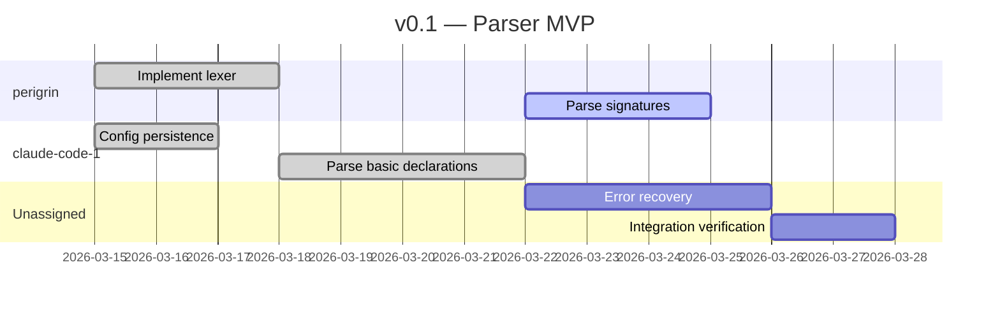
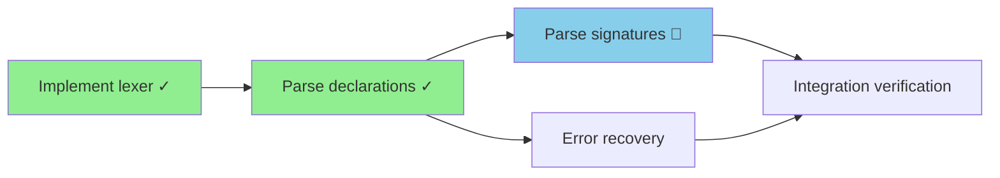

# git-zhi v0.3 — Enterprise: Product Requirements Document

## Overview

v0.3 takes git-zhi from a small-team development tool to one that works inside an existing enterprise ecosystem — with Jira boards, GitLab forges, Jama PRDs, shared repos, cross-repo projects, and people who will never touch a CLI. It does this without requiring anyone else to change their workflow.

v0.1 answers “what should I work on next?” v0.2 answers “can a team execute this milestone with quality gates?” v0.3 answers “how do I run this inside my actual company without disrupting the team?”

The key insight: zhi doesn’t need to replace existing tools. It sits behind them, providing the scheduling intelligence, forecasting, and telemetry that existing trackers don’t. The team works in their tracker. The devs commit in their forge. Zhi is the analytical engine that makes everything work better, adopted incrementally by one person before it reaches the team.

The key enabler is the historian — it turns an existing git log into a zhi chain, bootstrapping a repo from “flat commit history” to “structured issues with lineage, sessions, and telemetry baselines” in one command. No blank-slate adoption penalty. Day one forecasting from day one data.

## Problem Statement

v0.2 works for a small team that interacts with zhi directly. But an engineering manager introducing zhi to an established team with established tools faces different problems:

- **Existing tools can’t disappear.** Jira is where PMs live, GitLab is where MRs happen, Jama is where PRDs are. Zhi must integrate, not replace.
- **No history means no forecasting.** Zhi’s telemetry needs data. A fresh chain with no history can’t forecast anything. The repo’s existing git log and Jira tickets contain the history — it just needs to be imported.
- **Cross-repo projects.** Microservices mean multiple repos per project. No single chain has the full picture. The project-level view requires aggregation across repos.
- **Shared repos.** Multiple teams work in the same repo. Their work needs to coexist in the same chain with filtered views, not separate ownership boundaries.
- **Gradual adoption.** The team can’t stop work to learn a new tool. The first adopter (probably you) runs zhi silently while the team continues in Jira. Others join when they’re ready.
- **Cross-repo developer scheduling.** When devs work across multiple repos, “what’s next for me” is a cross-repo question that no single chain can answer.
- **Stakeholder reporting.** PMs and managers need recurring status reports, Gantt charts, quality metrics — in formats they can consume (Confluence, markdown) without learning zhi.

## Design Principles

1. **Zhi is source of truth per-repo, external trackers are federation buses.** Within a repo, zhi owns the chain. Across repos, an external tracker (Jira, GitLab, Linear, whatever the team uses) provides the cross-repo coordination layer. The historian is the core bridge between git reality and any external system. Sync plugins like `git-zhi-jira` are utilities that make communication with a specific tracker easier — they’re not architecturally privileged.
1. **Extension patterns over bespoke integrations.** v0.3 defines *patterns* for sync, aggregation, visualization, and reporting — with reference implementations. The patterns are the deliverable; the implementations are examples.
1. **Every skill must be human-executable.** Crochet automates skills; it doesn’t replace them. A human following the skill document with a terminal produces the same result. The LLM executes faster, not differently.
1. **Gradual adoption.** Day one: one person uses zhi, team sees Jira. Day thirty: devs start using `git zhi next`. Day sixty: the team wonders how they worked without it. No big-bang migration.
1. **Labels, not chains.** Shared repos use one chain with label-filtered views, not multiple chains. `refs/zhi/<label>/` is an index on `refs/zhi/_/`, not a separate data store.
1. **Agreement is signal.** When two independent records of the same history (git log and the external tracker) agree, confidence is high. Where they disagree, that’s where learning happens.

-----

## Labels and Indexes

v0.1 through v0.2 assume one chain per repo (`refs/zhi/_/`). v0.3 introduces label-filtered views for shared repos where multiple teams’ work coexists.

### One Chain, Filtered Views

The canonical data always lives in `refs/zhi/_/`. Every issue, every milestone, every ref. There is one issue dependency DAG per repo.

Labels on issues provide filtered views:

```bash
git zhi list                        # everything
git zhi list --label LOPS           # just LOPS team's work
git zhi list --label PLAT           # just PLAT team's work
git zhi milestone show --label LOPS # forecast for LOPS work only
```

The scheduler respects the full DAG even when filtered. If a LOPS issue depends on a PLAT issue, the filter shows the PLAT dependency as an external blocker — “your project is blocked by something outside your label” is exactly the information you need.

**Filtered view semantics:** `--label` scopes the *view* — only issues with that label appear in output. Dependencies from outside the label are shown as external blockers with their current state. `--ready --label LOPS` returns only LOPS issues whose dependencies (including cross-label ones) are satisfied. `--workers --label LOPS` forecasts only LOPS work, but the critical chain computation accounts for cross-label blockers as fixed delays. Unlabeled issues are excluded from any `--label` filter.

### Indexes as Performance Optimization

`refs/zhi/<label>/` is an index — a precomputed set of issue refs matching that label. It exists purely so `--label` doesn’t have to scan every issue each time.

Indexes are built and maintained by the historian (see below). They are derived data, not source of truth. Deleting an index and rebuilding it produces the same result.

### Issue Label Field

Issues gain an optional `labels` field in frontmatter:

```yaml
---
title: "Extract config service"
labels: ["LOPS", "microservices"]
---
```

Multiple labels are allowed. An issue can belong to multiple filtered views.

-----

## Core Ecosystem Changes

### Multiplayer

v0.2 introduced worker identity on state transitions. v0.3 extends this to team-level resource awareness.

#### Resource Attribution

Issues gain an optional `assigned` field:

```yaml
---
title: "Extract config service"
assigned: "dev-a"
---
```

Assignment is advisory, not enforced. The scheduler uses it for capacity analysis and the “what’s next for me” computation, but any worker can start any ready issue. This matches how teams actually work — assignments are intentions, not locks.

#### Team Capacity

The project plugin (see Integration Plugins) computes cross-repo capacity:

- Which workers are assigned to which repos
- Who has in-progress issues (and where)
- Who is available for new work
- Where contention exists (same person assigned to critical chain issues in multiple repos — they’re sequential, not parallel)

#### Contention Detection

When a worker is assigned to in-progress or ready issues in multiple repos, those issues are effectively sequential even if the DAGs say they could be parallel. `git zhi project` surfaces this:

```
$ git zhi project capacity

  dev-a:  in-progress in service-auth (019444a3)
          assigned in microservices (019555b2, 019555b4)
          ⚠ sequential bottleneck — 3 issues across 2 repos

  dev-b:  available
          assigned in microservices (019555b1)

  dev-c:  in-progress in microservices (019555b3)
          dedicated to microservices — no contention
```

-----

## git-zhi-historian — Core Extension

Every git repo already has a history. The historian is what makes that history *useful* — it turns a flat commit log into structured zhi issues with sessions, observed paths, actors, and lineage. That’s the bootstrap. Without it, adopting zhi in an existing repo means starting with a blank chain in a codebase with months or years of code. With it, you get lineage, telemetry baselines, and forecasting data from day one.

The historian is the onramp. Everything else — Jira enrichment, label indexes, tracker comparison, hypothesis validation — is layered on top of that core transformation: `git log` → zhi chain.

### Why It’s Core

The historian reads `git log` directly and writes to `refs/zhi/` — both canonical issue refs and label indexes. It imports `internal/issue`, `internal/graph`, `internal/storage`, and `internal/milestone` directly from the monorepo, enforcing all graph invariants (acyclic DAG, referential integrity, done/cancelled immutability) through the same code paths as core. Architecturally, the historian is a core extension — a separate binary that shares write access and internal packages — not a plugin. It lives in the monorepo at `cmd/git-zhi-historian/` with domain logic in `internal/historian/`. It needs to create retrospective issues from historical data that predates zhi’s existence, and it maintains the chain as an ongoing bridge between git activity and zhi state.

### Pipeline Model

The historian performs three operations in sequence:

**Extract** — parse `git log --use-mailmap` into raw commit data: author, timestamp, files changed, message, ticket references (parsed from commit message patterns). The `--use-mailmap` flag ensures author identities are normalized through git’s built-in `.mailmap` file, resolving variant names and email addresses to canonical identities before clustering. No custom alias system needed — the historian inherits git’s own identity normalization. For each commit, also extract a **diff fingerprint** via `git show --numstat --name-status`:

```
fingerprint:
  paths: sorted normalized file paths
  hunk_count: number of change hunks
  insertions: total lines added
  deletions: total lines removed
  change_ratio: insertions / (deletions + 1)
  renames: count of rename operations
  file_count: number of files touched
```

**Cluster** — group commits into issue candidates using a scoring model. Each pair of commits receives a similarity score based on multiple signals:

```
score(commit_a, commit_b) =
    ticket_match_weight          # highest: same ticket number
  + diff_fingerprint_similarity  # structural: same shape of change
  + path_overlap_weight          # spatial: same files
  + time_proximity_weight        # temporal: close in time
  + author_match_weight          # social: same developer
  + message_token_similarity     # lexical: shared significant words (low weight)
```

Message token similarity is lightweight — shared significant words (excluding stop words) between commit messages, not ML or embeddings. It breaks ties when other signals are ambiguous: “add yaml support” and “yaml config parsing” share a domain signal that “fix typo in README” doesn’t. When token overlap is zero between two commits touching the same files, a small penalty is applied — this prevents clustering commits with identical paths but different intent (e.g., “add validation” vs “refactor validation” in the same file).

**Algorithm: greedy sequential with centroid coherence.** Commits arrive in chronological order from `git log`. For each commit: (1) score it against every open cluster's centroid, (2) if the best score exceeds the join threshold, add to that cluster and update the centroid, (3) if no score exceeds the threshold, open a new cluster. Clusters close after a configurable inactivity gap with no new commits. This is the natural choice because git log is a time-ordered stream — no N×N similarity matrix required, scales linearly with commit count.

**Initial signal weights (provisional — to be calibrated in v0.3.1 against real repos with known-good issue boundaries):**

|Signal                  |Weight|Rationale                                                                   |
|------------------------|------|----------------------------------------------------------------------------|
|`ticket_match`          |0.40  |Strongest signal when present — same ticket ID is near-definitive           |
|`path_overlap`          |0.20  |Same files = probably same work, but refactors touch many files             |
|`diff_fingerprint`      |0.15  |Shape of change catches cherry-picks and similar work patterns              |
|`time_proximity`        |0.10  |Close in time = likely related, but developers context-switch               |
|`author_match`          |0.10  |Same author = weak signal (one person works on many things)                 |
|`message_tokens`        |0.05  |Shared words = weakest signal, breaks ties only                             |

**Initial thresholds (provisional):**

- **Join threshold: 0.35** — a commit needs roughly a ticket match alone (0.40) or strong path overlap plus a couple other signals. Intentionally low to over-cluster rather than under-cluster — splitting a large cluster in triage is easier than discovering two small clusters should have been one.
- **Centroid coherence threshold: 0.25** — lower than the join threshold because centroids dilute as clusters grow. A commit scoring below 0.25 against the centroid even though it scored above 0.35 against a member indicates cluster drift.
- **Inactivity gap: 14 days** — a cluster with no new commits for two weeks is closed, preventing long-running zombie clusters that attract unrelated commits months later.

These numbers are explicitly provisional. The v0.3.1 calibration work tunes them against real repos where historian output can be compared against known-good issue boundaries from a tracker.

Commits cluster when their score exceeds the join threshold. This handles cases that any single signal misses:

- **Cherry-picks**: different SHAs, different branches, but identical diff fingerprint → same cluster. Solves deduplication without special-casing.
- **Long-running tasks**: same author returns to same files after days. Time proximity is low, but diff fingerprint similarity and path overlap are high → same cluster.
- **Pair programming**: different authors, but same files and same change pattern → same cluster.
- **Refactors**: many files, low per-file change, high rename ratio → distinct fingerprint that avoids incorrectly merging with feature work.

**Cluster coherence constraint:** Pairwise scoring can cause transitive drift — A clusters with B, B clusters with C, but A and C are unrelated. To prevent this, each new commit is scored against the cluster centroid (the aggregate fingerprint and metadata of all commits already in the cluster), not just against its nearest member. A commit joins a cluster only if its score against the centroid exceeds the threshold. This keeps clusters tight and prevents unrelated work from accumulating through transitive similarity.

**Cluster split detection:** Even with centroid checks, clusters can become internally inconsistent over time — especially ticket-based clusters where a single Jira ticket covers unrelated work, or long-running clusters that accumulate drift. `git zhi historian status` surfaces low-coherence clusters:

```
Cluster 019444a3 (LOPS-142):
  ⚠ low coherence (0.42) — 12 commits, 2 distinct file groups
  → consider splitting: commits 1–7 touch internal/auth/, commits 8–12 touch internal/config/
```

The historian does not auto-split — that’s a judgment call for the human or for interactive triage. It surfaces the signal.

Fallback strategies when scoring produces no strong clusters:

1. **Ticket reference only** (confidence 0.70–0.95) — commits sharing the same ticket number form one issue regardless of other signals.
1. **Author + time + path** (confidence 0.40–0.70) — when no ticket reference exists, cluster on the traditional signals.
1. **Single commit** (confidence 0.30) — each commit becomes its own issue when no clustering signal exists.

**Clustering accuracy expectations:** With ticket numbers in commit messages, >80% of commits auto-map to issues mechanically. Without ticket numbers, expect 40–70% clustering accuracy depending on commit discipline and repo structure. Interactive triage resolves the remainder.

**Enrich** — augment clustered issues with external metadata:

- Tracker enrichment (Jira, GitLab): title, description, assignee, status, dependencies, epic/milestone membership
- Label assignment from tracker project prefix or `--label` flag
- Actor mapping from git author or tracker assignee
- Session construction: start_sha/end_sha from commit range boundaries
- Observed paths: the **union of all files touched by each commit** in the session, not a single diff between start_sha and end_sha. A single endpoint diff misses files that were modified and then reverted, or interleaved changes from merge commits. Per-commit union captures everything the session actually touched.

Each stage is independent. You can extract and cluster without enriching (no tracker access needed). You can re-enrich later when a tracker connection becomes available.

### Non-Interactive Mode

The common case is fully mechanical. Parse commit messages for ticket references, map commits to issues, enrich from Jira if available:

```bash
# Map commits by ticket prefix, assign label
git zhi historian --title-match "LOPS-*" --label LOPS

# Enrich from Jira metadata (titles, assignees, statuses, deps)
git zhi historian --tracker jira --project LOPS --label LOPS

# Default: every commit as a separate retrospective issue
git zhi historian

# Show what's mapped and what's not
git zhi historian status
```

Non-interactive flags:

- `--title-match <pattern>` — match ticket references in commit messages
- `--tracker <n>` — enrich from external tracker (jira, gitlab)
- `--project <n>` — tracker project to query
- `--label <n>` — assign label to imported issues
- `--since <date>` — only process commits after this date
- `--dry-run` — show what would be imported without writing

### Interactive Mode

For unmapped commits and ambiguous cases, the historian presents decisions like `git bisect` or `git rebase -i`:

```
$ git zhi historian triage

Auto-mapped: 712/847 commits (84%) across 138 Jira tickets

Unmapped commit cluster 1 of 12:
  6 commits by dev-a, 2025-02-15..2025-02-16
  Files: internal/config/loader.go, internal/config/loader_test.go
  Messages:
    "extract config loading"
    "add yaml support"
    "tests for config loader"
    "fix edge case"
    "cleanup imports"
    "add godoc"

  [a]ssign to existing issue  [n]ew issue  [s]kip  [m]erge with adjacent  [q]uit
```

The user makes decisions; the historian records them. Subsequent runs of `historian triage` present only remaining unmapped commits.

### Hypothesis Comparison

The historian produces an interpretation of history. Jira holds a different interpretation. Comparing them reveals where planning and reality diverged.

The historian defaults to starting from Jira’s structure and validating it against git reality:

```
$ git zhi historian --tracker jira --project PROJ --compare

Starting from Jira hypothesis (142 tickets)...

Strong agreement (127 tickets):
  Jira ticket boundaries match commit clustering
  → imported as-is

Partial agreement (11 tickets):
  PROJ-48: Jira says 1 story, git shows 2 distinct commit clusters
    → suggest splitting
  PROJ-89: Jira says 2 stories, git shows 1 body of work
    → suggest merging
  PROJ-62, PROJ-63: Jira says 2 stories under 2 epics,
    git shows 1 body of work (73% file overlap, 1 author, 3 days)
    → epic boundary is artificial here

No git evidence (4 tickets):
  PROJ-112, PROJ-115, PROJ-118, PROJ-121
  Tickets exist in Jira but no commits reference them
  → import as pending/cancelled?

Unmapped commits (34):
  No Jira ticket reference
  → run: git zhi historian triage
```

**Agreement is signal.** Where git and the tracker agree, the chain accurately represents what happened. Where they disagree, either the tracker was wrong (stories badly scoped) or the code drifted from the plan. Both are learning opportunities.

The agreement rate from the historian informs future decomposition. When `crochet:refinement` breaks the next PRD into issues, it can check: “historically, 90% of stories matched git reality — our decomposition granularity is good” or “only 60% matched — stories are consistently wrong-sized.”

### Retrospective Issues

Issues created by the historian are retrospective records, not work to be done. They have:

- Title (from Jira ticket or generated from commit messages)
- State: `done` or `cancelled`
- Sessions with start/end SHAs mapped from commit ranges
- `observed_paths` from `git diff` across the session
- Actor from git author or Jira assignee
- Labels from Jira project prefix or `--label` flag
- Dependencies from Jira links (if enriched)
- **Confidence score** — how reliably the historian mapped this issue

#### Confidence Scores

Every retrospective issue carries a confidence score (0.0–1.0) and a source indicator reflecting how it was constructed:

|Source         |Typical Confidence|Meaning                                                                      |
|---------------|------------------|-----------------------------------------------------------------------------|
|`tracker-match`|0.85–0.95         |Commits matched a ticket reference and tracker metadata confirmed the mapping|
|`ticket-ref`   |0.70–0.85         |Commits matched a ticket reference but no tracker enrichment available       |
|`cluster`      |0.40–0.70         |Heuristically clustered by author, time, and path proximity                  |
|`single-commit`|0.30              |Fallback — one commit, one issue, no external validation                     |
|`manual`       |1.0               |Human assigned via interactive triage                                        |

Confidence scores inform downstream consumers:

- **Lineage** — high-confidence retrospective issues provide reliable context enrichment. Low-confidence issues are flagged as approximate: “this lineage is based on heuristic clustering and may not reflect actual work boundaries.”
- **Sanbao** — telemetry baselines derived from high-confidence issues are reliable. Metrics from low-confidence issues are weighted accordingly or excluded from baselines.
- **Hypothesis comparison** — disagreement between the historian and the tracker is more meaningful when the historian’s confidence is high. Low-confidence clustering that disagrees with the tracker is probably just the historian being wrong, not an insight about bad decomposition.

They do not have acceptance criteria, steps, or context blocks — those are forward-looking fields for planned work. Retrospective issues exist to provide lineage. When a new issue modifies code, lineage traces back through the historian’s retrospective issues to show who built what and why.

### Ongoing Maintenance

The historian isn’t just a bootstrap tool. As the team works and commits with ticket numbers, the historian updates the chain:

```
Devs work → commit with PROJ-XXX → push to GitLab
    ↓
git zhi historian --incremental
    ↓
Chain updates — new commits mapped to existing issues,
sessions extended, observed_paths updated, indexes rebuilt
    ↓
git zhi jira sync (pushes state changes back to Jira)
```

**Incremental processing marker:** The historian tracks its progress via `refs/zhi/_/historian/last_processed_sha`. Each run processes only commits after this marker and updates it on completion. This prevents reprocessing history and makes incremental runs fast. If the marker is missing or the user passes `--full`, the historian processes the entire log.

**History rewrite handling:** If the repository has been force-pushed or rebased, `last_processed_sha` may no longer exist in the current history. The historian detects this (`git merge-base --is-ancestor`) and falls back:

```
⚠ History rewritten — last_processed_sha not in current history.
  Falling back to nearest ancestor or full reprocess.
  Run: git zhi historian --full to rebuild from current history.
```

This prevents silent corruption when history is rewritten. The historian never assumes its marker is valid — it verifies before processing.

**Clustering config versioning:** The historian records its clustering configuration in `refs/zhi/_/historian/config`:

```yaml
version: "0.3"
weights:
  ticket: 1.0
  diff: 0.8
  path: 0.6
  time: 0.3
  author: 0.4
  token: 0.2
threshold: 0.65
```

When weights or thresholds change (tuning after v0.3.1 pressure testing, version upgrades), `git zhi historian --rebuild` detects the config delta and reports what changed:

```
Rebuilding with updated clustering config (0.3 → 0.3.1)
  Changed: diff weight 0.8 → 0.85, threshold 0.65 → 0.60
  Affected: 14 clusters may change — run with --dry-run to preview
```

Without config versioning, threshold tuning produces unexplained chain changes. With it, every change is attributable and reversible.

This can run on a post-receive hook, a cron job, or manually. The team’s workflow doesn’t change — they commit with ticket numbers as they always have. The historian keeps the chain current.

### Index Maintenance

The historian builds and rebuilds label indexes under `refs/zhi/<label>/`:

```bash
# Rebuild all indexes
git zhi historian reindex

# Rebuild a specific label index
git zhi historian reindex --label LOPS
```

Indexes are rebuilt from the canonical `refs/zhi/_/` data. They’re derived, not authoritative.

-----

## Integration Plugin Patterns

v0.3 defines integration patterns with reference implementations. Each pattern specifies the interface; the implementations are examples that others can follow.

All integration plugins use the `git zhi` CLI as their interface to chain state. They never read or write `refs/zhi/` directly. This is the architectural boundary between core ecosystem and integration plugins:

```
Core ecosystem (reads/writes refs/zhi/):
  git-zhi, git-zhi-verify, git-zhi-sanbao,
  git-zhi-docs, git-zhi-historian

Integration plugins (uses git zhi CLI):
  git-zhi-jira, git-zhi-gitlab, git-zhi-project,
  git-zhi-mermaid, Crochet, Scribe (future)
```

**Privileged writer invariant:** Only two components may write to `refs/zhi/`: git-zhi core and git-zhi-historian. All other core ecosystem plugins (verify, sanbao, docs) read refs but never write them. All integration plugins interact exclusively through the CLI. This invariant is non-negotiable — new plugins must not introduce additional ref writers. If a new capability requires writing to refs, it belongs in git-zhi core or the historian, not in a plugin.

Integration plugins can be written in any language. The `git-zhi-*` naming convention requires only an executable on `$PATH`.

### Sync Pattern

A sync plugin mirrors state between zhi and an external tracker. Zhi is source of truth for per-repo work; the external tracker provides cross-repo coordination and stakeholder visibility.

**Outbound (deterministic):** State changes in zhi push to the tracker automatically.

|Zhi Event                  |Tracker Action                    |
|---------------------------|----------------------------------|
|Issue created              |Create ticket/story               |
|Issue state → in-progress  |Transition ticket to “In Progress”|
|Issue state → done         |Resolve/close ticket              |
|Milestone progress         |Update epic/version progress      |
|Scope cut (issue cancelled)|Close ticket as won’t-do          |
|Urgency changed            |Update priority                   |
|Assignment changed         |Update assignee                   |

**Inbound metadata (deterministic):** Simple field changes in the tracker flow back without needing intelligence.

|Tracker Event   |Zhi Action                        |
|----------------|----------------------------------|
|Priority changed|Update urgency                    |
|Comment added   |Append to issue context (optional)|
|Assignee changed|Update assigned field             |

**Sync conflict resolution:** When the same field is changed in both zhi and the tracker between sync cycles, a conflict exists. The rule: **tracker fields override only if the zhi field is unchanged since the last sync.** Each sync cycle records a `last_synced_at` timestamp per issue. Three cases:

- **Zhi unchanged, tracker changed** → tracker value pulls inbound to zhi.
- **Zhi changed, tracker unchanged** → zhi value pushes outbound to tracker.
- **Both changed** → conflict. Neither side wins automatically. The sync reports the conflict and the user decides. This follows the "agreement is signal" design principle — disagreement between zhi and the tracker is where learning happens, not where one side silently overwrites the other.

This prevents race conditions where a PM’s priority change in the tracker silently overwrites a developer’s urgency change in zhi, or vice versa.

Conflicts are logged:

```
$ git zhi jira sync pull

Synced:
  LOPS-142  Priority changed high → critical  → updated 019444a3 urgency

Conflicts (both changed since last sync — manual resolution required):
  LOPS-145  Jira assignee changed to mjones, zhi assigned to dev-c
            → resolve with: git zhi jira resolve LOPS-145 --keep-zhi | --keep-tracker
```

**Dry-run for conflict preview:** `git zhi jira sync --dry-run` shows what would change without executing, including conflicts that would overwrite tracker values. This is essential for building trust during adoption — a PM who sees “3 conflicts will overwrite tracker values” before it happens is far less likely to fight the system than one who discovers it after the fact.

**Inbound new work (human-assisted):** When a new ticket appears in the tracker (PM creates it, customer files it), the sync plugin flags it for human attention. The human decides where it fits in the chain:

```
$ git zhi jira sync pull

Synced:
  LOPS-142  Priority changed high → critical  → updated 019444a3 urgency
  LOPS-145  Comment added by PM               → appended to 019444a5 context

Needs attention:
  LOPS-148  "Fix auth token refresh" (new ticket, no chain mapping)
    → Run: git zhi issue add --from jira:LOPS-148
    → Then wire dependencies manually

  LOPS-151  "Update rate limiter config" (new ticket, no chain mapping)
    → Run: git zhi issue add --from jira:LOPS-151
```

Crochet can assist with import (`crochet:import LOPS-148` reads the ticket and proposes placement, deps, AC), but it’s opt-in. The sync works without it.

**Identity mapping:** Two layers handle identity normalization. Git’s `.mailmap` resolves variant names and emails to canonical git identities (the historian uses this automatically). The sync plugin then maps those canonical git identities to tracker usernames via git config:

```bash
git config zhi.sync.jira.actor.dev-a "jsmith"
git config zhi.sync.jira.actor.dev-b "mjones"
```

**Reference implementation:** `git-zhi-jira`

### Project Aggregation Pattern

A project aggregation plugin provides the cross-repo view. It reads a project definition, walks each repo’s chain via CLI, and produces combined output.

**Project definition file** (`~/.config/zhi/projects/` or in-repo):

```yaml
name: Auth Overhaul
jira:
  initiative: LOPS-100
repos:
  - path: ~/dev/service-auth
    milestone: v2.1
  - path: ~/dev/service-api
    milestone: v3.0
  - path: ~/dev/service-frontend
    milestone: v1.4
workers:
  - actor: dev-a
    repos: [service-auth, microservices, service-api]
  - actor: dev-b
    repos: [microservices, service-frontend]
  - actor: dev-c
    repos: [microservices]
```

**Two views, same data:**

Manager view — “how’s the project?”

```
$ git zhi project report auth-overhaul

Auth Overhaul (3 repos)

  service-auth     v2.1   6/8 done   GREEN   speed: 2.1/week
  service-api      v3.0   3/10 done  YELLOW  speed: 1.4/week
  service-frontend v1.4   8/8 done   COMPLETE

  Aggregate: 17/26 issues (65%)
  Bottleneck: service-api (critical path for initiative)
  Forecast: ~3.2 weeks remaining (constrained by service-api)
```

Developer view — “what’s next for me?”

```
$ git zhi project next --actor dev-a

You have no in-progress issues.

Available across your projects:
  1. service-auth    019444a3  Parse signatures        (critical chain, blocking 3 downstream)
  2. microservices   019555b2  Extract config service   (critical chain, blocking 1 downstream)
  3. service-api     019666c1  Rate limiter middleware   (off-chain, no urgency)

Recommendation: #1 — highest downstream impact across all projects.
```

The project plugin runs `git zhi milestone show --format json`, `git zhi sanbao report --format json`, `git zhi list --ready --format json` in each repo and combines the results. Cross-repo dependencies come from two sources: the external tracker (via MCP or sync plugin) and the project definition file. **Precedence rule:** the project definition overrides the tracker for cross-repo dependencies. The project owner knows their actual dependency structure better than the tracker’s link graph, which may be stale, incomplete, or over-connected. Tracker links are used only when the project definition is silent.

#### Cross-Repo Critical Chain Project Management

Within a single repo, zhi manages the project buffer on the milestone (v0.1). But Critical Chain Project Management (CCPM) has three types of buffers, and two of them — feeding buffers and resource buffers — are inherently cross-path concepts. In the multi-repo world, cross-path means cross-repo. `git-zhi-project` is the only component with visibility across repos, so it’s where full CCPM lives.

**Cross-repo critical chain.** The project plugin computes the longest sequential dependency path across all repos in the project. Repo A’s milestone might feed into Repo B’s, which feeds into Repo C’s. The cross-repo critical chain determines when the initiative actually delivers — not when any single repo finishes.

**Project buffer.** The aggregate buffer protecting the initiative’s delivery date. Sized at 50% of the cross-repo critical chain duration (Goldratt’s standard rule — cut aggressive estimates in half, pool the safety). Buffer consumption thresholds follow standard CCPM: GREEN < 1/3 consumed, YELLOW between 1/3 and 2/3, RED > 2/3. These thresholds apply relative to project completion progress — a buffer 50% consumed with 80% of work done is GREEN; the same consumption at 30% done is RED.

**Feeding buffers.** At each cross-repo dependency junction, a feeding buffer absorbs delays from the feeder repo before they impact the downstream repo. Sized at 50% of the feeding chain duration (the non-critical path that merges into the critical chain at the junction). Same GREEN/YELLOW/RED thresholds as the project buffer. Without feeding buffers, every repo’s forecast is independent and the project-level forecast ignores the reality that Repo B can’t start integration until Repo A delivers.

**Resource buffers.** When a shared developer needs to switch repos, the resource buffer provides early warning. Resource buffers are not time buffers — they are signals placed before a shared resource handoff. If dev-a is finishing an issue in service-auth and is needed by microservices in two days, the resource buffer signals whether the handoff is on track or at risk. No consumption math; the indicator is binary (on track / at risk) based on the upstream issue’s progress relative to the handoff date.

The project definition declares cross-repo dependencies alongside repos and workers:

```yaml
name: Auth Overhaul
jira:
  initiative: LOPS-100
repos:
  - path: ~/dev/service-auth
    milestone: v2.1
  - path: ~/dev/service-api
    milestone: v3.0
    feeds:
      - repo: service-auth
        buffer: 3d
  - path: ~/dev/service-frontend
    milestone: v1.4
    feeds:
      - repo: service-auth
        buffer: 2d
  - path: ~/dev/shared-libs
    milestone: v1.2
    feeds:
      - repo: service-api
        buffer: 2d
workers:
  - actor: dev-a
    repos: [service-auth, microservices, service-api]
  - actor: dev-b
    repos: [microservices, service-frontend]
  - actor: dev-c
    repos: [microservices]
```

**Project-level CCPM output:**

```
$ git zhi project show auth-overhaul

Auth Overhaul — due Apr 15

Cross-repo critical chain:
  shared-libs v1.2 → service-api v3.0 → service-auth v2.1

Project buffer: 8 days (42% consumed) — YELLOW

Feeding buffers:
  service-api → service-auth:  3 days remaining (GREEN)
  shared-libs → service-api:   1 day remaining (RED ⚠)
    shared-libs is 2 days behind; feeding buffer nearly exhausted
    Impact: service-api blocked in ~1 day unless shared-libs delivers
  service-auth → service-frontend:  2 days remaining (GREEN)

Resource buffers:
  dev-a: finishing service-auth 019444a3 (~1 day remaining)
         needed by microservices 019555b2 in ~2 days — OK
  dev-b: available now
         needed by service-api 019666c4 — ready to start
```

The per-repo fever chart tells you if *that repo* is healthy. The project-level CCPM tells you if the *initiative* is healthy. Feeding buffers are where projects break — not within a repo but at the handoff points between them.

**Duration estimation for cross-repo scheduling:** The cross-repo critical chain requires issue duration estimates. These come from sanbao telemetry in each repo:

- **Primary source**: historical median issue cycle time (start → done) for that repo, filtered by label if applicable. This is observed data, not estimates. **Important:** the baseline excludes low-quality retrospective issues (confidence < 0.7, source = `cluster` or `single-commit`) which may represent badly scoped work, interruptions, or misattributed commits. Only planned issues and high-confidence retrospective issues feed the duration model. This prevents skewed durations from corrupting forecasts.
- **Fallback**: configurable default duration per repo in the project definition (`default_issue_duration: 2d`), used when a repo has insufficient telemetry history.
- **Refinement**: as the project accumulates data, duration estimates shift from the fallback toward observed medians automatically.

**Buffer computation:** Buffer sizes can be declared explicitly in the project definition (`buffer: 3d`) or computed heuristically. The heuristic uses 50% of the remaining feeding chain duration (consistent with CCPM’s buffer sizing principle within single-repo milestones). As telemetry accumulates, observed variability refines the buffer — high-variability feeding paths get larger buffers, low-variability paths get smaller ones.

**Reference implementation:** `git-zhi-project`

### Visualization Pattern

A visualization plugin transforms zhi’s JSON output into renderable formats. It reads JSON from stdin or CLI flags and produces Mermaid, SVG, or other visual formats.

```bash
# Gantt chart with resource lanes
git zhi milestone show v0.1 --format json | git zhi mermaid --gantt

# Dependency DAG with status coloring
git zhi list --format json | git zhi mermaid --dag

# Cross-repo project Gantt
git zhi project report auth-overhaul --format json | git zhi mermaid --gantt
```

**Gantt output:**



**DAG output:**



Duration in Gantt charts comes from observed telemetry (speed, MPG), not estimates. Resource lanes come from worker identity.

Mermaid renders natively in GitHub/GitLab markdown, Confluence, and most documentation platforms. No server, no infrastructure.

**Reference implementation:** `git-zhi-mermaid`

### Report Template Pattern

Report templates are user-defined markdown files with YAML frontmatter that declare data sources, prompt, structure, and audience. Crochet’s `crochet:report` skill reads templates and produces narrative reports.

**Template location:** `docs/reports/` (per-repo) or `~/.config/zhi/reports/` (personal)

**Template format:**

```yaml
---
name: recurring-status
data:
  - git zhi project report auth-overhaul --format json
  - git zhi sanbao report HEAD --format json
  - git zhi verify HEAD --format json
  - git zhi docs health --format json
schedule: recurring
---

## Prompt

Produce a team status report for our recurring review. Tone is
professional but direct. Lead with what shipped, then risks, then
forecast. Embed mermaid-gantt and mermaid-dag charts. Keep it
under 500 words. Highlight any issues with difficulty score
above 2.0 or sustained negative sentiment.

## Structure

### Summary
### What Shipped
### Risks & Blockers
### Forecast
### Quality Health
### Charts
```

The `structure:` section is authoritative — the LLM produces exactly these sections in this order. The `prompt:` provides narrative guidance within that structure (tone, length, what to emphasize). If the prompt requests sections not in the structure, the structure wins.

**Usage:**

```bash
# Generate a report
crochet:report recurring-status

# Generate for a specific milestone
crochet:report recurring-status --milestone v0.1

# List available templates
crochet:report --list
```

The `data` field declares which CLI commands to run. Crochet executes them, feeds the JSON results plus the prompt into the LLM, and produces markdown following the declared structure.

A human can follow the same process manually: run the data commands, read the JSON, write the report following the structure. Crochet just does it faster.

**Different audiences, different templates:**

- `recurring-status.md` — team standup, Confluence-friendly, includes charts
- `stakeholder-summary.md` — executive audience, outcome-focused, under 200 words
- `quality-health.md` — rework trends, complexity hotspots, doc drift
- `sprint-retro.md` — what shipped this period, velocity trends, struggles

New report types are just new files. No code changes, no plugin updates.

The `schedule` field is metadata — eventually a CI job or cron could run `crochet:report` automatically and post to Confluence. For now it’s documentation of intent.

### Import Pattern

When external work items need to enter the chain, the import pattern provides a consistent interface:

```bash
# Import a single ticket
git zhi issue add --from jira:LOPS-148

# Import an epic as a milestone with all its stories
git zhi issue add --from jira:LOPS-100 --recursive

# Import a GitHub issue
git zhi issue add --from gitlab:42
```

The `--from` flag tells the sync plugin to pull metadata from the tracker: title, description, assignee, status, linked tickets. The issue is created in zhi with whatever metadata is available. Dependencies from tracker links are wired automatically.

What `--from` does *not* do is decide where the issue fits in the existing dependency graph (beyond what tracker links provide), generate acceptance criteria, write context blocks, or decompose large tickets into session-sized issues. Those require human judgment or Crochet assistance.

### Onboard Pattern

Onboarding zhi into an existing ecosystem is a skill document — a human-executable procedure that Crochet can also follow.

**The onboard workflow:**

1. **Historian bootstrap.** Run the historian with Jira enrichment to build the retrospective chain from existing history.
   
   ```bash
   git zhi historian --tracker jira --project LOPS --label LOPS
   git zhi historian --compare   # validate against Jira structure
   git zhi historian triage      # resolve unmapped commits interactively
   ```
1. **Documentation setup.** Initialize or update CONTRIBUTING.md and the `docs/` structure.
   
   ```bash
   git zhi docs init
   # Review and update CONTRIBUTING.md with project conventions
   ```
1. **PRD assessment.** Pull PRDs from Jama (via MCP or browser), assess against existing codebase. Identify gaps, blockers, partial implementations. This step is Crochet-assisted or manual.
1. **Chain construction.** Run `crochet:refinement` or manually create milestones and issues for forward-looking work, informed by the historian’s retrospective data and the PRD assessment.
1. **Sync setup.** Configure outbound sync to Jira so new zhi issues create Jira tickets and state changes flow back.
   
   ```bash
   git config zhi.sync.jira.project LOPS
   git config zhi.sync.jira.actor.dev-a "jsmith"
   # ... identity mappings for team
   ```
1. **Verify the bridge.** Run `git zhi jira sync` and confirm tickets appear correctly in Jira. The team should see no disruption — just better-organized tickets.
1. **Silent operation.** Run zhi daily. The team works in Jira and GitLab. The historian keeps the chain current from their commits. Sync keeps Jira updated from zhi. Reports are generated from zhi data.
1. **Gradual team adoption.** As individuals are ready, introduce them to `git zhi next` and `git zhi issue show`. They start picking up issues from zhi rather than Jira. Jira stays in sync either way.

The onboard skill document contains this full procedure with decision points, verification steps, and rollback instructions. A human can execute it in an afternoon. Crochet can assist at steps 3 and 4.

-----

## Crochet v0.3 Skills

Crochet accesses *chain state* (issues, milestones, telemetry) exclusively through `git zhi` CLI commands — the porcelain/plumbing boundary. It reads the *codebase* directly (source files, git log, directory structure) as a Claude Code plugin with full file access. This distinction matters: Crochet never writes to `refs/zhi/`, but skills like `crochet:assess` need to read `.go` files and directory layouts to analyze code against requirements.

### crochet:report

Described above in Report Template Pattern. Reads user-defined prompt templates, executes data collection commands, synthesizes narrative reports with embedded Mermaid charts.

### crochet:assess

Reads a PRD (from Jama via MCP, from a file, or from stdin) and assesses it against the existing codebase and chain:

- **Missing** — capabilities the PRD requires that don’t exist in code
- **Partial** — code that does some of what’s needed but needs extension
- **Blocking** — existing code or architecture that conflicts with requirements and needs refactoring before the requirement can be met
- **Ready** — code that already satisfies a requirement

Uses lineage data from the historian to trace who built what and why. Output informs `crochet:refinement` — blocking items become prerequisite refactoring issues at the front of the chain.

A human can do this manually: read the PRD, grep the codebase, check `git log`, list the gaps. Crochet does it faster and more thoroughly.

### crochet:import

Reads an external ticket (Jira, GitLab) via MCP and proposes chain placement:

- Suggests dependencies based on `context.paths` overlap with existing issues
- Drafts acceptance criteria from the ticket description
- Proposes urgency from tracker priority
- Suggests label from tracker project

Output is a proposed `git zhi issue add` command with all fields populated. The human reviews and approves. Opt-in — the sync plugin works without it.

### crochet:onboard

The automated executor of the onboard skill document. Runs the full onboarding workflow, pausing for human approval at decision points. Uses the historian, docs init, Jira sync setup, and optionally assess/refinement.

Not required — a human with the skill document and a terminal does the same thing.

-----

## The Monday Morning Walkthrough

You’re an engineering manager. Your team has 7 devs, 4 SQEs, 2 PMs. Code is in GitLab, tickets in Jira, PRDs in Jama. You have three major projects, one minor cross-cutting project, and ongoing support work. You’ve been asked for recurring status reports.

You pick the cross-cutting microservices project — your coordination repo. Three devs, one dedicated, two shared. Some Jira tickets written, PRDs in Jama, existing code.

**Monday morning:**

```bash
cd ~/dev/microservices-platform

# Bootstrap zhi from existing history
git zhi historian --tracker jira --project LOPS --label LOPS --compare

# Review the comparison — where does Jira match git reality?
# Accept the aligned tickets, note the disagreements for later

# Triage unmapped commits
git zhi historian triage

# Set up docs structure
git zhi docs init

# Set up Jira sync
git config zhi.sync.jira.project LOPS
git config zhi.sync.jira.actor.dev-a "jsmith"
git config zhi.sync.jira.actor.dev-b "mjones"
git config zhi.sync.jira.actor.dev-c "apatel"

# Pull PRD from Jama, assess against codebase
# (Crochet-assisted or manual)
crochet:assess path/to/prd.md

# Build the forward-looking chain from the PRD
crochet:refinement path/to/prd.md

# Sync to Jira — new issues become Jira tickets
git zhi jira sync push

# Set up recurring report template
# Create docs/reports/recurring-status.md with your template
```

**Tuesday standup:**

Your PMs see new, well-structured Jira tickets with dependencies. Your devs see a prioritized backlog. Nobody knows zhi exists.

**The next two weeks:**

Devs commit with `LOPS-XXX` in their messages. The historian runs periodically (cron or post-receive hook), keeping the chain current. Jira sync pushes state changes. You run `git zhi milestone show` to check forecasts. You run `git zhi sanbao report` to check quality.

**Bi-weekly report day:**

```bash
crochet:report recurring-status
# Produces a markdown document ready for Confluence
```

**Week four:**

Dev C asks “how do you always know what to work on next?” You show them `git zhi next`. They start using it. The adoption spreads from there.

-----

## Implementation Phases

### Phase 1: Labels and Indexes

- `labels` field on issues
- `--label` filter flag on `list`, `milestone show`, and other read commands
- Index structure under `refs/zhi/<label>/`
- Index build/rebuild commands

### Phase 2: Multiplayer Enhancements

- `assigned` field on issues
- Team capacity computation
- Contention detection (same worker across repos)
- Integration with worker identity from v0.2

### Phase 3: git-zhi-historian (core extension)

- Non-interactive import: `--title-match`, `--tracker`, `--label`
- Jira enrichment (titles, assignees, statuses, dependencies)
- Interactive triage mode
- Hypothesis comparison (`--compare`)
- Retrospective issue creation with sessions and observed_paths
- Incremental mode for ongoing maintenance
- Index building and maintenance
- `historian status` for coverage reporting

### Phase 4: Sync Pattern + git-zhi-jira (reference implementation)

- Outbound state sync (zhi → Jira)
- Inbound metadata sync (Jira → zhi)
- Human-assisted import for new tickets
- Identity mapping via git config
- `--from jira:TICKET` import flag

### Phase 5: Project Aggregation + git-zhi-project (reference implementation)

- Project definition file format (repos, workers, cross-repo dependency feeds, buffer declarations)
- Manager view: `git zhi project report`
- Developer view: `git zhi project next --actor`
- Cross-repo capacity and contention analysis
- Cross-repo critical chain computation
- CCPM buffer management: project buffer, feeding buffers, resource buffers
- Buffer status reporting (GREEN/YELLOW/RED per buffer)
- JSON output for report consumption

### Phase 6: Visualization + git-zhi-mermaid (reference implementation)

- Gantt chart with resource lanes from JSON input
- DAG visualization with status coloring from JSON input
- Cross-repo project Gantt from project plugin JSON
- stdin and file input modes

### Phase 7: Report Templates + crochet:report

- Template format specification (YAML frontmatter + prompt + structure)
- Template discovery (`docs/reports/` and `~/.config/zhi/reports/`)
- Data collection from declared CLI commands
- Narrative synthesis with Mermaid chart embedding
- `--list` flag for available templates

### Phase 8: Crochet v0.3 Skills

- `crochet:assess` (PRD vs codebase gap analysis)
- `crochet:import` (assisted ticket import with chain placement)
- `crochet:onboard` (automated onboarding workflow)

### Phase 9: Onboard Skill Document

- Human-executable onboarding procedure
- Decision points, verification steps, rollback instructions
- Covers historian bootstrap, docs setup, sync configuration, gradual adoption

-----

## Issue Schema (v0.3 additions)

v0.3 adds the following fields to the issue schema defined in v0.2:

|Field         |Type           |Source                 |Description                                                                                                  |
|--------------|---------------|-----------------------|-------------------------------------------------------------------------------------------------------------|
|labels        |[]string       |frontmatter            |Team/project labels for filtered views                                                                       |
|assigned      |string         |frontmatter            |Advisory worker assignment                                                                                   |
|confidence    |float (0.0–1.0)|frontmatter (historian)|How reliably the historian mapped this issue                                                                 |
|source        |string         |frontmatter (historian)|How the issue was constructed: `tracker-match`, `ticket-ref`, `cluster`, `single-commit`, `manual`, `planned`|
|tracker_id    |string         |frontmatter (sync)     |External tracker reference (e.g., `jira:LOPS-142`)                                                           |
|last_synced_at|timestamp      |frontmatter (sync)     |Last sync cycle timestamp for conflict resolution                                                            |

Issues created by the historian also carry all v0.2 fields (sessions, observed_paths, transitions with actor identity) populated from git history.

**Retrospective issues** (created by the historian) are distinguishable by `source` being one of `tracker-match`, `ticket-ref`, `cluster`, `single-commit`, or `manual`. **Planned issues** (created by users or Crochet) have `source: planned` or no source field.

## Sync Plugin Credentials

Sync plugins require API tokens for external trackers. Credentials follow git’s existing patterns:

- **Git config**: `git config zhi.sync.jira.token <token>` (repository or user level)
- **Environment variables**: `ZHI_JIRA_TOKEN`, `ZHI_GITLAB_TOKEN`
- **Git credential helper**: for platforms that support it, delegate to the same credential helper git uses for HTTPS authentication

Environment variables take precedence over git config. Tokens are never stored in `refs/zhi/` or committed to the repository.

## Performance Characteristics

Historian and index performance is bounded by `git log` and `git blame` performance, which are well-understood and scale predictably with repository size. For reference:

- **Historian full run**: proportional to total commit count. A repo with 100k commits processes in minutes on modern hardware. The diff fingerprinting adds `git show --numstat` per commit, which is fast (no diff computation, just stat counting).
- **Historian incremental**: proportional to commits since last run. Typically seconds.
- **Index rebuild**: proportional to total issue count. Scanning labels on thousands of issues is fast — it’s metadata reads, not content parsing.
- **Label-filtered queries**: index lookup, effectively constant time.

For very large repositories (>500k commits), the initial historian run may take significant time. The `--since` flag allows scoping to recent history when full archaeology isn’t needed.

-----

## Success Criteria

v0.3 is successful if:

1. A manager can introduce zhi to a team-specific repo and generate their first recurring report within one day, without the team changing their workflow
1. The historian bootstraps a meaningful chain from an existing repo’s git history — >80% of commits auto-mapped to issues when ticket numbers are in commit messages. Sanbao can compute telemetry baselines (speed, MPG) from day one without waiting for new issues to complete
1. The historian’s hypothesis comparison against the external tracker reveals at least one decomposition insight (“these stories were actually one body of work” or “this epic boundary is artificial”)
1. Tracker sync keeps tickets current without manual intervention — state changes in zhi appear in the external tracker within minutes
1. `git zhi project next --actor` gives a developer a useful cross-repo recommendation that accounts for their current workload
1. `git zhi project show` surfaces cross-repo critical chain and feeding buffer status — a manager can see which repo’s delay will cascade into which other repo before it happens
1. Mermaid Gantt and DAG exports render correctly in Confluence and GitLab markdown
1. Report templates produce stakeholder-ready documents that require minimal editing
1. The onboard skill document is executable by a human with no Crochet access — every step works via CLI alone
1. A team of 7+ devs can work through their existing tracker while zhi runs silently, with the manager as the only direct zhi user, and see improved project visibility

-----

## v0.3.1 — Post-Release Refinement: Calibration and Validation

The following items require real-world data to validate and are expected to ship as a point release after v0.3 is running against actual repos.

### Calibration (data-dependent tuning)

**CCPM pressure test.** Run `git zhi project show` against real multi-repo projects with real cross-repo feeds. Validate that the critical chain, feeding buffer status, and forecasts match the project owner’s understanding of where bottlenecks actually are. Tune duration estimation (median cycle time vs other heuristics) and buffer sizing (50% rule vs observed variability) based on what the data shows. The architecture supports iteration; the math needs real data to calibrate.

**Clustering threshold tuning.** Run the historian against several repos with known work history. Compare historian output against known-good issue boundaries. Tune the scoring weights, centroid coherence threshold, and confidence score ranges. Different repo cultures (commit frequency, message discipline, squash vs merge) may need different defaults.

**Telemetry mode impact assessment.** After running against repos with different merge strategies, evaluate whether `squash_limited` mode produces useful forecasts or whether additional adaptations are needed.

### Validation Skills (systematic verification of LLM-generated output)

v0.3 introduces two LLM-powered generation pipelines: the historian’s clustering and enrichment, and Crochet’s expanding skill set (assess, import, refinement, report). Both pipelines produce structured output that silently drifts from intent. Calibration (above) tunes the parameters. Validation catches the drift that tuning alone cannot prevent.

The methodology draws from Curtis "Ovid" Poe’s PAAD framework ([Why I Am No Longer Reading the AI’s Code](https://curtispoe.org/articles/why-i-am-no-longer-reading-the-ais-code.html)), which identifies four failure modes in AI-assisted development — spec gaps (**Pushback**), task-spec misalignment (**Alignment**), structural rot (**Architecture**), and silent quality erosion (**Degradation**). Poe’s central finding: none of these failures are optional checks. Over a year of experimentation, pushback found gaps in every spec, alignment found drift in every task list, architecture review found rot in every codebase that skipped it, and degradation crept in whenever verification lapsed. The failures are systematic, not occasional.

The same failure modes apply to any pipeline where an LLM interprets intent and produces structured output — which is exactly what the historian and Crochet do. v0.3.1 formalizes the countermeasures as reusable Crochet skills.

**`crochet:pushback` as a generalized skill.** v0.2 introduced pushback as a pre-refinement check on PRDs. v0.3.1 generalizes it to any structured input that an LLM will act on:

- **Before refinement** (v0.2 behavior): scan the PRD for omissions, ambiguities, contradictions, and hidden dependencies. Interactive resolution with the user.
- **Before historian ref-writing** (new): scan the historian’s `--dry-run` output for implausible dependencies (commits in unrelated codepaths linked by temporal coincidence), inconsistent granularity (one 47-commit issue next to five 2-commit issues), and temporal ordering violations (issue B depends on issue A, but A’s commits came after B’s).
- **Before report generation** (new): scan the report template’s data sources against the chain state. Are the declared CLI commands returning stale data? Does the template reference milestones or labels that don’t exist?

Same methodology, different inputs. The skill document describes the verification pattern; the specific checks are parameterized by context.

**`crochet:alignment` as a generalized skill.** v0.2 introduced alignment as a post-refinement check between tasks and spec. v0.3.1 generalizes it:

- **Refinement output vs PRD** (v0.2 behavior): every requirement covered? No phantom features? Dependency directions reflect actual technical constraints?
- **Historian output vs git log** (new): every commit accounted for? Dependency directions consistent with temporal ordering? No orphaned work? Coverage reported by `historian status` is the quantitative alignment metric; this skill adds the structural check.
- **Historian output vs external tracker** (already exists as `--compare`): the hypothesis comparison is alignment under a different name. v0.3.1 formalizes this by having `crochet:alignment` consume the `--compare` output and flag cases where the historian’s high-confidence clustering disagrees with the tracker — these are the decomposition insights worth investigating, not noise.
- **Forward chain vs historical chain** (new): when `crochet:refinement` runs after `historian bootstrap`, do the forward-looking issues connect sensibly to the retrospective ones? Does the refinement’s decomposition account for what the historian discovered about actual work patterns? If the historian shows the auth module was touched by 14 issues with declining coherence, and refinement produces a single "Refactor auth module" issue, that’s a misalignment between the forward plan and historical reality.

**Telemetry confidence reporting.** Sanbao gains a data quality assessment that reports the composition of the telemetry baseline: what percentage of the data driving forecasts comes from high-confidence historian issues (>0.7) vs low-confidence clusters (<0.5) vs planned issues with real session data. This is degradation detection at the data layer — if 60% of your telemetry baseline is derived from low-confidence clustering, your forecasts deserve less trust than the fever chart implies. The confidence report surfaces this rather than hiding it behind a single GREEN/YELLOW/RED indicator.

```
$ git zhi sanbao confidence v0.1

Telemetry baseline quality:
  Planned issues (real sessions):     12 issues  (41%)  — high signal
  Retrospective (tracker-match):      11 issues  (38%)  — good signal
  Retrospective (cluster, conf >0.7):  3 issues  (10%)  — moderate signal
  Retrospective (cluster, conf <0.5):  3 issues  (10%)  — low signal

Forecast reliability: MODERATE
  41% of baseline from planned issues with real session data.
  Forecasts will improve as more planned issues complete.
  ⚠ 3 low-confidence retrospective issues included in speed calculation.
    Exclude with: git zhi sanbao report --min-confidence 0.7
```

### Design Principle: Validation Is Not Optional

Poe’s PAAD framework encodes a finding that is easy to understate: over a year of systematic experimentation, pushback found something in *every* spec, and alignment found drift in *every* task list. Not most. Every. The LLM doesn’t betray you with obviously wrong output — it betrays you with almost-right output that does slightly more, or slightly less, than what you specified.

This has a direct implication for v0.3.1: the calibration work (threshold tuning, CCPM pressure testing, telemetry mode assessment) will reveal that the historian’s clustering is wrong in specific, non-obvious ways. The validation skills exist to catch these drifts *systematically* rather than discovering them when a forecast fails or a retrospective issue doesn’t match anyone’s memory of what happened.

The validation skills are Crochet skills, not git-zhi features. They require LLM intelligence to evaluate structural quality — "is this dependency graph sensible?" is not a question a deterministic binary can answer. But the data they validate is git-zhi’s data, and the confidence metrics they produce feed back into sanbao’s forecasting. The boundary remains clean: git-zhi stores and schedules, sanbao observes and measures, Crochet thinks and validates.

-----

## Non-Goals (v0.3)

- Cross-chain dependencies within a repo (labels + filtering are sufficient)
- Cross-chain scheduling (each repo’s DAG is independent; cross-repo coordination is the external tracker’s job)
- Real-time sync (periodic/triggered sync is sufficient for v0.3 team sizes)
- Interactive web UI (Mermaid exports and Confluence cover reporting needs)
- GitLab MR integration (reference impl is Jira; GitLab sync follows the same pattern)
- Automated report delivery to Confluence/Slack (manual posting or CI scripting is sufficient)
- GC/snapshot compaction (v0.4)

-----

## Known Limitations

### Shared Repos with Non-Zhi Teams

When your team and other teams work in the same repo but only your team uses zhi, the historian sees other teams’ commits as unattributed noise. The `--title-match` flag filters by ticket prefix, so commits with other projects’ ticket numbers are ignored rather than incorrectly imported. Commits with no ticket number and no recognizable author land in the triage queue.

This is a partial solution. The historian gives you space to grow into full shared-repo support — your team’s work is cleanly tracked, other teams’ work is excluded rather than corrupted. When other teams adopt zhi in the same repo (v0.4), their work enters the chain under their own labels, the historian retroactively imports their history, and the full DAG becomes visible.

Full multi-team shared repo support — including cross-label dependency visibility, label-scoped scheduling, and coordinated index management — is a v0.4 deliverable.

### Squash Merge History Loss

Teams that use squash merges collapse an entire branch of work into a single commit. The historian can still map that commit to a ticket (if the ticket number is in the squash commit message), but it loses the intermediate history that makes clustering, session granularity, and sentiment trajectory meaningful.

With squash merges:

- One commit per ticket → sessions have one entry, MPG is always 1, sentiment trajectory is a single point
- Clustering heuristics for unmapped commits are less effective — there’s less signal to cluster on
- Lineage is coarser — blame maps to single squash commits rather than the specific change within a branch

This isn’t fatal — the historian still works, issues still map to tickets, lineage still traces. But the telemetry baselines are less granular and the session-level detail that makes sanbao’s analysis rich (sentiment trajectory, commit patterns, session duration) is reduced to single data points per issue.

The historian auto-detects squash-heavy repos (commit-per-ticket ratio approaching 1:1, merge commits with single parents) and classifies the repo’s telemetry mode:

```yaml
telemetry_mode: full_history    # normal — multi-commit sessions
telemetry_mode: squash_limited  # degraded — single-commit sessions
```

Downstream tools adapt. Sanbao skips sentiment trajectory analysis in `squash_limited` mode and reports MPG as unavailable rather than reporting a misleading constant of 1. Forecast accuracy relies on cycle time and completion frequency rather than session-level granularity.

Teams that use merge commits or rebase-and-merge preserve the full commit history and get the most value from the historian’s analysis.

-----

## Future Considerations

1. **Interactive web UI** — HTMX-driven local server that reads from git refs. Fever charts, drag-and-drop issue ordering, visual DAG, clickable state transitions. Becomes more valuable as team adoption grows beyond the CLI-comfortable.
1. **GitLab sync reference implementation** — Same sync pattern as `git-zhi-jira`, targeting GitLab’s issue and MR APIs. Important for teams whose forge is also their issue tracker.
1. **Real-time sync via webhooks** — Instead of periodic sync, Jira/GitLab webhooks trigger immediate chain updates. Reduces latency from minutes to seconds. Requires a listener process.
1. **Automated report delivery** — CI job runs `crochet:report`, posts to Confluence page or Slack channel automatically. The template’s `schedule` field drives the cadence.
1. **Cross-repo dependency tracking** — Currently external trackers mediate cross-repo dependencies. A future version could track them natively in zhi, with cross-repo refs or a coordination layer above the project plugin.

-----

## Relationship to v0.2

v0.3 builds on v0.2’s foundation:

|v0.2 Feature                        |v0.3 Extension                                                 |
|------------------------------------|---------------------------------------------------------------|
|Worker identity                     |→ Multiplayer: assignment, capacity, contention                |
|`--format json` on all commands     |→ Integration plugin data contract                             |
|Lineage tracking                    |→ Historian uses lineage for retrospective analysis            |
|`observed_paths`                    |→ Historian records observed_paths from historical commits     |
|Issue state machine with transitions|→ Sync pattern maps transitions to tracker state changes       |
|VADER sentiment in sanbao           |→ Report templates surface sentiment trends                    |
|`crochet:refinement`                |→ `crochet:assess` adds codebase gap analysis before refinement|
|`crochet:postmortem`                |→ Report templates generalize retrospective output             |
|docs/ convention                    |→ Report templates live in `docs/reports/`                     |

v0.2’s `--format json` on every command is the foundation that makes v0.3’s integration pattern possible. The JSON output is the integration contract.
